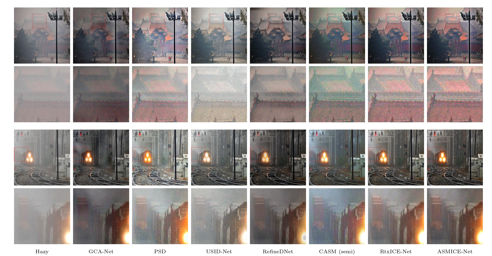

# Inverse Consistency Entangled Mutual Learning Framework for Semi-Supervised Image Dehazing

This is the official PyTorch implementation of our paper Inverse Consistency Entangled Mutual Learning Framework for Semi-Supervised Image Dehazing.  


For more details: [[Official Link]()] 

> **Abstract:** 
Haze diminishes image quality by reducing contrast and obscuring details. Supervised dehazing models require real-world paired data, which are difficult to obtain. Semi-supervised methods offer a promising alternative but often rely on contrastive learning with unpaired clean images or atmospheric scattering model (ASM) embeddings. These strategies face limitations: contrastive learning struggles to provide effective guidance in scenes with light haze due to subtle feature differences, whereas ASM-based embeddings depend on physical assumptions that may not hold in complex real-world conditions.
To address these challenges, we propose a semi-supervised dehazing framework that bridges the gap between synthetic and real-world domains. Our method combines supervised pre-training on synthetic data with unsupervised adaptation through a novel Inverse Consistency Entangled Mutual Learning (ICEML) strategy.
ICEML leverages dual embeddings from ASM and Retinex theory to train two complementary networks—RtxICE-Net and ASMICE-Net—that guide each other through mutual consistency constraints.
This entangled learning enables each network to compensate for the other's weaknesses and allows the model to better understand and generalize across real-world haze distributions.
Despite having only 0.534M and 1.068M parameters, the performance of our networks surpasses that of state-of-the-art methods across multiple datasets. RtxICE-Net further demonstrates real-time capability, processing 1024×1024 images at 33.5 FPS. These results underscore the effectiveness, efficiency, and practical adaptability of the ICEML-based single-image dehazing framework.


## Environment and Dependencies:

- CUDA Version: 11.6
- Python: 3.9.12
- torch: 1.12.0


## Pretrained Weights

Pretrained weight can be found in `models`: `final_dehazing_model.pth`

## Test

For testing single images without ground truth, organize the test images in the following way:

```
output
    |- (image filename)
    |- ...
    |- ...
```

### To test RtxICE-Net

Run: `src/test_rtxice_only.py`

The dehazed images are saved in the following way:

```
test_input
    |- J_RtxICE-Net
        |- (dehazed image)
        |- ...
```

### To test ASMICE-Net

Run: `src/test_rtxice_only.py`

This will produce both the dehazed image as well as the corresponding transmission map.

The dehazed images are saved in the following way:

```
output
    |- J_ASMICE-Net
        |- (dehazed image)
        |- ...
```

The corresponding transmission maps are saved in the following way:

```
output
    |- trm_ASMICE-Net
        |- (dehazed image)
        |- ...
```


### Model Latency
To evaluate model performance metrics (latency, FPS, and model size), run: `src/model_latency.py`

The script will generate `latency_results.txt` in `output` containing:
- Inference speed for different image resolutions
- Frames per second (FPS)

### Model Size

To get the model size, run: `python src/model_size.py`

The script will generate `model_info.txt` in `output`, containing the number of parameters and model size in megabytes for both ASMICE-Net and RtxICE-Net.


## Results



## Contact
If you have any questions or issues contact us via: <ali.murtaza.ali29@outlook.com>

## License
Licensed under a [Creative Commons Attribution-NonCommercial 4.0 International](https://creativecommons.org/licenses/by-nc/4.0/) for Non-commercial use only.
Any commercial use should get formal permission first.


## 📄 Citation

If you find our repo useful for your research, please cite us:

```bibtex
@article{
}


